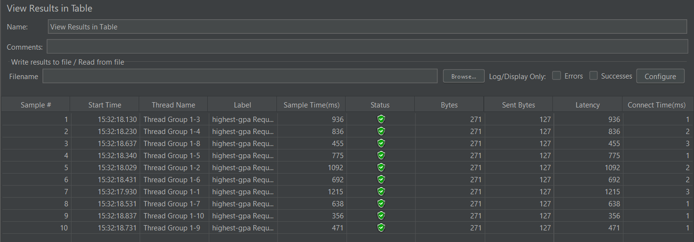
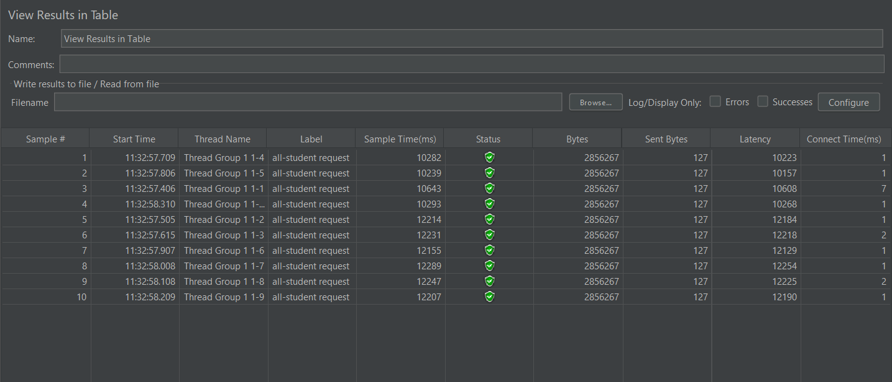

JMETER GUI

- /all-student endpoint in JMETER GUI

- /all-student-name endpoint in JMETER GUI

- /highest-gpa endpoint in JMETER GUI

JMETER CLI

- /all-student endpoint in JMETER CLI
  
- /all-student-name endpoint in JMETER CLI
  
- /highest-gpa endpoint in JMETER CLI
  

Profile before and after optimizing

- /all-student
  - before:
  
  - after:
  

- /all-student-name
  - before:
  
  - after:
  

- /highest-gpa
  - before:
  
  - after:
  

JMETER After Optimization

- /all-student
  
- /all-student-name
  
- /highest-gpa 
  

Conclusion:
Berdasarkan hasil pengujian performa menggunakan JMeter sebelum dan sesudah proses profiling serta optimasi dilakukan, terlihat adanya peningkatan performa yang signifikan. Contohnya, pada pengujian endpoint \all-student, sebelum optimasi, rata-rata waktu respon (Sample Time) untuk setiap permintaan berada di kisaran 231.000 - 243.000 ms (sekitar 231 hingga 243 detik), yang menunjukkan bahwa aplikasi membutuhkan waktu yang sangat lama untuk merespon permintaan "all-student request". Sementara itu, setelah dilakukan profiling dan perbaikan pada bagian kode yang menjadi bottleneck, hasil pengujian setelah optimasi menunjukkan bahwa waktu respon turun drastis menjadi kisaran 10.200 - 12.400 ms (sekitar 10 hingga 12 detik).

Dari perbandingan ini, dapat disimpulkan bahwa ada peningkatan performa yang sangat signifikan setelah dilakukan proses profiling dengan IntelliJ Profiler dan optimasi kode. Waktu respon berhasil dikurangi lebih dari 90% dari kondisi awal. Hal ini membuktikan bahwa langkah-langkah profiling dan optimasi yang dilakukan efektif dalam memperbaiki kinerja aplikasi. Dengan performa yang jauh lebih baik, aplikasi dapat merespons permintaan dengan lebih cepat dan efisien sehingga meningkatkan pengalaman pengguna.

Reflection

**1. What is the difference between the approach of performance testing with JMeter and profiling with IntelliJ Profiler in the context of optimizing application performance?**  

Pengujian performa dengan JMeter dilakukan untuk melihat bagaimana aplikasi bekerja ketika mendapatkan beban dari banyak pengguna secara bersamaan. JMeter membantu mengukur kecepatan respon, kapasitas, dan ketahanan aplikasi. Sementara itu, IntelliJ Profiler digunakan untuk menganalisis bagian dalam dari aplikasi, seperti melihat metode mana yang paling banyak menggunakan CPU, memori, atau mengalami hambatan. Jadi, JMeter lebih fokus pada performa aplikasi secara keseluruhan dari sisi luar, sedangkan IntelliJ Profiler fokus pada performa kode di dalam aplikasi.

---

**2. How does the profiling process help you in identifying and understanding the weak points in your application?**

Proses profiling membantu mengidentifikasi bagian kode yang memakan banyak sumber daya seperti CPU dan memori. Dengan IntelliJ Profiler, kita bisa melihat metode mana yang berjalan paling lama atau objek apa saja yang banyak dibuat selama aplikasi berjalan. Selain itu, profiling juga bisa mendeteksi masalah pada thread, seperti deadlock atau thread yang saling menunggu. Dari data tersebut, kita bisa memahami di mana letak hambatan performa dan fokus memperbaikinya secara langsung pada bagian kode yang bermasalah.

---

**3. Do you think IntelliJ Profiler is effective in assisting you to analyze and identify bottlenecks in your application code?**

Menurut saya, IntelliJ Profiler cukup efektif untuk menemukan bottleneck pada kode, terutama untuk aplikasi yang kompleks. Fitur-fiturnya seperti analisa CPU, memori, dan thread sangat membantu dalam melihat langsung proses mana yang lambat atau berat. Selain itu, tampilannya yang terintegrasi dengan IDE memudahkan pengembang untuk langsung melakukan profiling tanpa perlu alat tambahan. Namun, untuk aplikasi skala besar atau yang berjalan di lingkungan produksi, biasanya perlu dikombinasikan dengan alat lain seperti APM.

---

**4. What are the main challenges you face when conducting performance testing and profiling, and how do you overcome these challenges?**

Tantangan dalam pengujian performa seperti JMeter adalah membuat skenario yang benar-benar mencerminkan perilaku pengguna nyata. Untuk mengatasi ini, saya biasanya membuat data uji dan skenario yang mendekati kondisi di produksi. Tantangan dalam profiling adalah performa aplikasi bisa melambat saat diprofiling, sehingga sulit mendapatkan hasil seperti di kondisi normal. Cara mengatasinya adalah dengan membatasi ruang lingkup profiling hanya pada proses yang ingin dianalisis. Tantangan lain adalah memahami hasil profiling yang kompleks, untuk itu saya fokus pada hotspot yang ditunjukkan oleh profiler.

---

**5. What are the main benefits you gain from using IntelliJ Profiler for profiling your application code?**

Manfaat utama menggunakan IntelliJ Profiler adalah dapat mengetahui dengan cepat bagian kode mana yang perlu dioptimalkan. Dengan profiler, saya bisa melihat metode yang paling banyak menggunakan CPU, memori yang bocor, atau masalah pada thread. Selain itu, karena langsung terhubung dengan IntelliJ, proses profiling menjadi lebih mudah tanpa perlu konfigurasi tambahan. Hasilnya, proses analisis dan perbaikan performa menjadi lebih cepat dan efisien.

---

**6. How do you handle situations where the results from profiling with IntelliJ Profiler are not entirely consistent with findings from performance testing using JMeter?**

Jika hasil profiling dan JMeter tidak konsisten, saya biasanya memeriksa ulang apakah skenario yang dijalankan saat profiling sama dengan saat tes JMeter. Kadang, perbedaan bisa muncul karena profiling dilakukan di lingkungan lokal yang berbeda dengan server. Selain itu, JMeter mengukur dari sisi pengguna, sementara profiler dari sisi kode, jadi bisa saja ada faktor lain seperti database atau jaringan yang mempengaruhi hasil JMeter. Untuk memastikan, saya juga menggunakan monitoring tambahan seperti logging atau APM untuk melihat gambaran yang lebih utuh.

---

**7. What strategies do you implement in optimizing application code after analyzing results from performance testing and profiling? How do you ensure the changes you make do not affect the application's functionality?**

Setelah menganalisis hasil pengujian performa dan profiling, saya biasanya fokus memperbaiki metode yang memakan banyak waktu atau memori. Misalnya, dengan memperbaiki algoritma, mengurangi pemanggilan database yang berlebihan, atau menambahkan cache. Agar perubahan tidak merusak fungsi aplikasi, saya selalu menjalankan unit test, integration test, dan regression test. Selain itu, saya lakukan code review dan uji coba bertahap di staging sebelum diterapkan ke produksi. Dengan cara ini, performa aplikasi meningkat tanpa mengorbankan stabilitas dan fungsionalitas.

